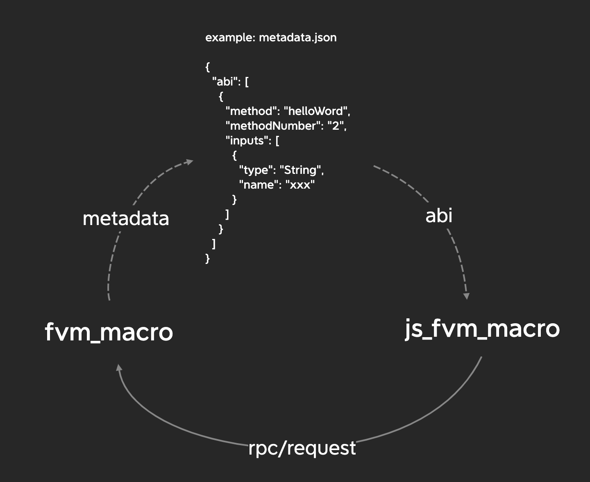

#FVM-macro

This attribute like macros the `fvm-macro` defines the smart contract writing sdk. According to this sdk,
developers only need to care about the business logic code, and needn't to care about the load and save of the state.

```rust
#[fvm_macro(state)]
pub struct HelloWorld {
    pub count: u64,
}
```

Generates the following:

```rust
impl State for HelloWorld {
    fn load() -> Self {
        let root = match sdk::sself::root() {
            Ok(root) => root,
            Err(err) => abort!(USR_ILLEGAL_STATE, "failed to get root: {:?}", err),
        };

        match Blockstore.get_cbor::<Self>(&root) {
            Ok(Some(state)) => state,
            Ok(None) => abort!(USR_ILLEGAL_STATE, "state does not exist"),
            Err(err) => abort!(USR_ILLEGAL_STATE, "failed to get state: {}", err),
        }
    }

    fn save(&self) -> Cid {
        let serialized = match to_vec(self) {
            Ok(s) => s,
            Err(err) => abort!(USR_SERIALIZATION, "failed to serialize state: {:?}", err),
        };

        let cid = match sdk::ipld::put(Code::Blake2b256.into(), 32, DAG_CBOR, serialized.as_slice())
        {
            Ok(cid) => cid,
            Err(err) => abort!(USR_SERIALIZATION, "failed to store initial state: {:}", err),
        };

        if let Err(err) = sdk::sself::set_root(&cid) {
            abort!(USR_ILLEGAL_STATE, "failed to set root ciid: {:}", err);
        }
        cid
    }
}

```

When use attribute `#[fvm_macro(message)]`, the load and save methods are inserted into the contract method. Used to
update the contract state .

```rust
#[fvm_macro(message)]
pub fn say_hello(&mut self) -> Option<RawBytes> {
    self.count = self.count + 1;
    let ret = to_vec(format!("Hello world #{}!", self.count).as_str());
    match ret {
        Ok(ret) => {
            return Some(RawBytes::new(ret));
        }
        Err(err) => {
            abort!(
            USR_ILLEGAL_STATE,
            "failed to serialize return value: {:?}",
            err
            );
        }
    }
}
```

Generates the following:

```rust
pub fn say_hello(&mut self) -> Option<RawBytes> {
    self.count = self.count + 1;
    self.save();
    let ret = to_vec(format!("Hello world #{}!", self.count).as_str());
    match ret {
        Ok(ret) => {
            return Some(RawBytes::new(ret));
        }
        Err(err) => {
            abort!(
            USR_ILLEGAL_STATE,
            "failed to serialize return value: {:?}",
            err
            );
        }
    }
}

pub fn invoke(id: u32) -> u32 {
    let _params = sdk::message::params_raw(id).unwrap().1;
    let _params = RawBytes::new(_params);
    let ret: Option<RawBytes> = match sdk::message::method_number() {
        1u64 => HelloWorld::constructor(),
        2u64 => <HelloWorld>::load().say_hello(),
        _ => fvm_sdk::vm::abort(
            fvm_shared::error::ExitCode::USR_UNHANDLED_MESSAGE.value(),
            Some(
                {
                    let res = ::alloc::fmt::format(::core::fmt::Arguments::new_v1(
                        &["unrecognized method"],
                        &[],
                    ));
                    res
                }
                    .as_str(),
            ),
        ),
    };
    match ret {
        None => NO_DATA_BLOCK_ID,
        Some(v) => match sdk::ipld::put_block(DAG_CBOR, v.bytes()) {
            Ok(id) => id,
            Err(err) => fvm_sdk::vm::abort(
                fvm_shared::error::ExitCode::USR_SERIALIZATION.value(),
                Some(
                    {
                        let res = ::alloc::fmt::format(::core::fmt::Arguments::new_v1(
                            &["failed to store return value: "],
                            &[::core::fmt::ArgumentV1::new_display(&err)],
                        ));
                        res
                    }
                        .as_str(),
                ),
            ),
        },
    }
}
```

A brief introduction to the calling logic of fvm_macro and js_fvm_macro
